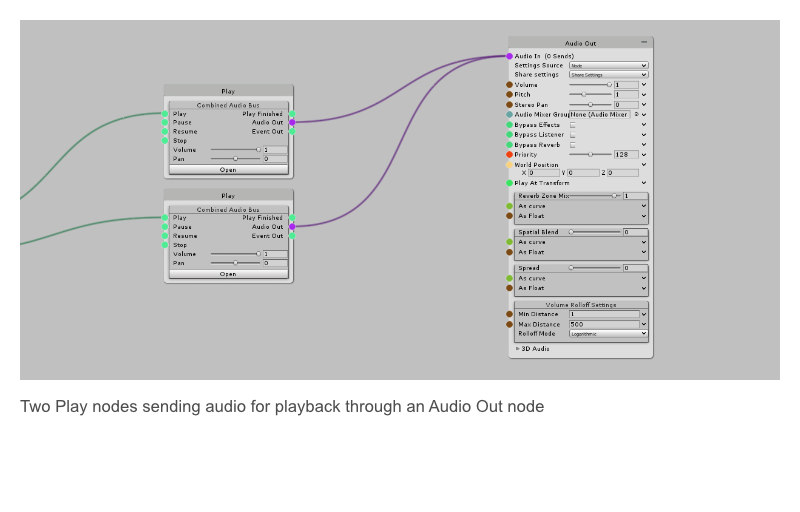

## About

The Audio Out node is an output node through which all graph audio is played. It defines the settings with which the audio is played, as well as where the audio is played. See the [Audio Out](Audio-Out) node page for more information, and see the [Play](Play) and [Sampler Track](Sampler-Track) nodes for examples of nodes that output to Audio Outs.
