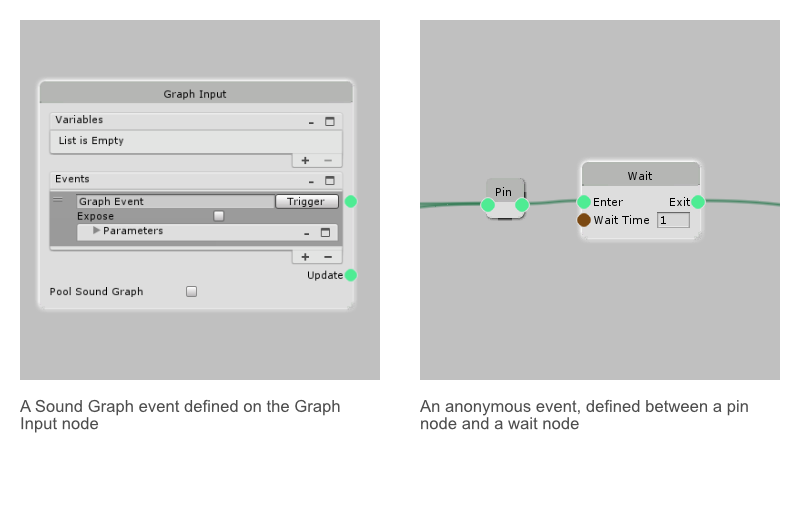

## About
Events are how nodes are sequenced in a Sound Graph. Events can carry MIDI data and arbitrary parameters. There are two types of events, named Sound Graph events, and anonymous events. Sound Graph events are defined in the [Graph Input](Graph-Inputs) node, and can be triggered within the sound graph using the [Trigger](Trigger-Event) node, and externally the event is exposed. Anonymous events are produced by nodes.

